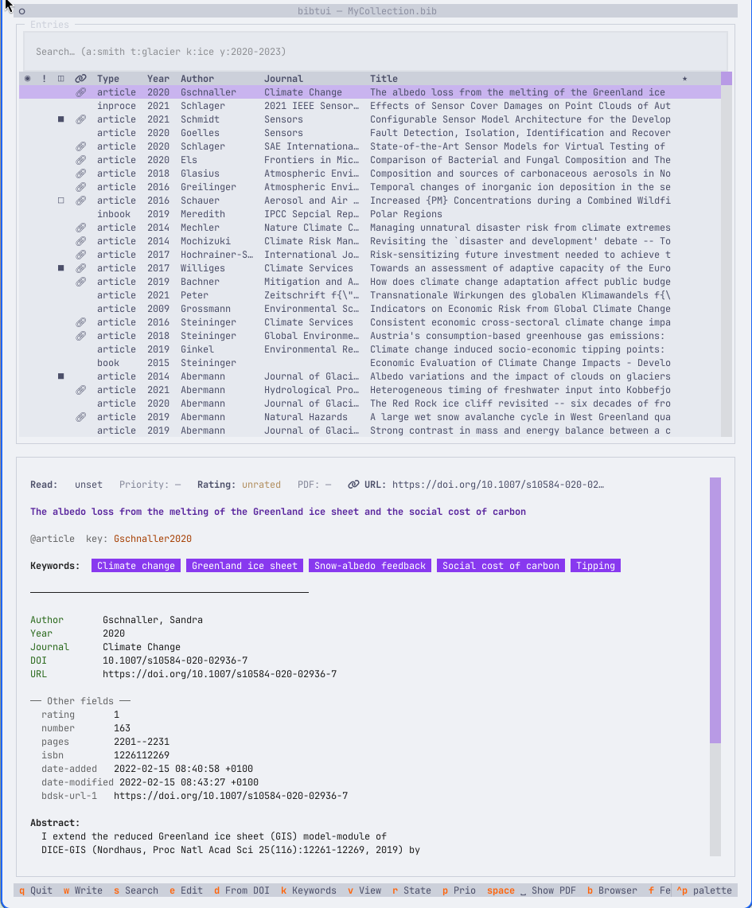
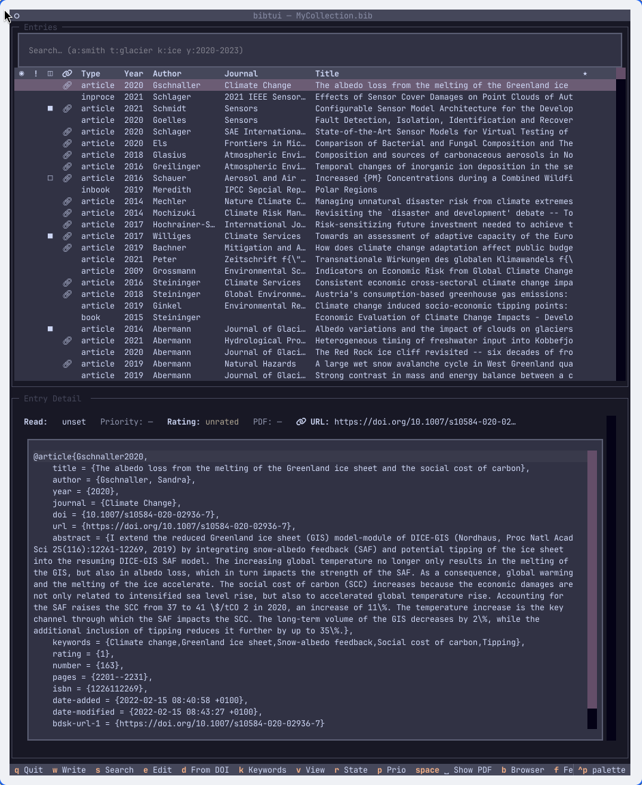
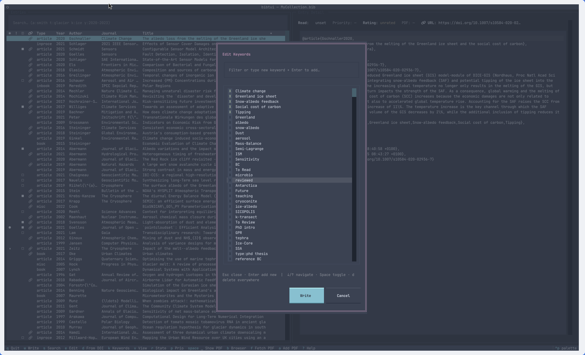

# bibtui

> A quiet, powerful home for your references.

[](https://pypi.org/project/bibtui/)
[](https://www.python.org/)
[](LICENSE)

## Quick start

```bash
uvx bibtui myrefs.bib
```

-----
## Screenshots

<!-- screenshots -->

| Light theme                            | Dark — Catppuccin Mocha                    |
| -------------------------------------- | ------------------------------------------- |
|  |  |

| Nord — keywords modal                              |  |
| --------------------------------------------------- | - |
|  |  |

<!-- recording -->

<!--  -->

---

**bibtui** is a beautiful, keyboard-driven terminal app for researchers who live
in the terminal. Browse and edit your `.bib` file, fetch open-access PDFs with a
single keystroke, track what you've read, and never leave the command line —
no database, no sync daemon, no account required.

---

## Why bibtui?

|                                  | bibtui | JabRef  | Zotero |
| -------------------------------- | ------ | ------- | ------ |
| Runs in the terminal             | ✅     | ❌      | ❌     |
| No database / sync daemon        | ✅     | ✅      | ❌     |
| Git-friendly plain `.bib`        | ✅     | ✅      | ❌     |
| Works over SSH                   | ✅     | ❌      | ❌     |
| Full Textual theming             | ✅     | ❌      | ❌     |
| Pure Python, installs in seconds | ✅     | ❌      | ❌     |

---

## Features

- **Browse & search** — instant search across title, author, keywords, and cite key
- **Import by DOI** — paste a DOI and metadata is fetched automatically
- **Fetch PDFs automatically** — tries arXiv → Unpaywall (free, open-access) → direct URL
- **Add existing PDFs** — pick a file from your Downloads folder with a live filter
- **Edit entries** — field-by-field form *or* raw BibTeX editor (toggle with `v`)
- **Read states & priorities** — track what you've read and what matters most
- **Star ratings** — rate entries 1–5
- **Keywords editor** — manage tags inline
- **JabRef-compatible** — file links use JabRef conventions; open the same `.bib` in both tools
- **Git-friendly** — it's a plain text file (.bib); commit, diff, and collaborate normally
- **Full Textual theme support** — including automatic detection of the [omarchy](https://omarchy.org) themes
- **Works anywhere `uv` does** — SSH, HPC clusters, a colleague's laptop

---

## Installation

### Recommended — uv (fastest)

```bash
uv tool install bibtui
```

### pip

```bash
pip install bibtui
```

### Try without installing

```bash
uvx bibtui references.bib
```

---

## Usage

```
bibtui MyCollection.bib
```

On first launch bibtui shows a short onboarding wizard that pre-fills sensible
defaults for your PDF directory, Downloads folder, and Unpaywall email
(no registration required — the email is only used for rate-limiting).

---

## PDF workflow

`f` tries three sources in order:

1. **arXiv** — for entries with a `10.48550/arXiv.*` DOI or an `arxiv.org` URL
2. **Unpaywall** — free open-access lookup by DOI (set your email in Settings; no account needed)
3. **Direct URL** — if the entry's `url` field points directly to a PDF

PDFs are saved to your configured base directory and the entry's `file` field is
updated automatically in JabRef format.

---

## Philosophy

- Your `.bib` file is the source of truth
- No hidden database
- No setup, point and shoot possible
- No lock-in
- No accounts
- keyboard and mouse support
- nice looking
- focused featurset. For cleanup use [bibtex-tidy](https://github.com/FlamingTempura/bibtex-tidy) or work directly on the bib file

## Development

```bash
git clone https://github.com/tgoelles/bib_tui
cd bib_tui
uv sync
uv run bibtui tests/bib_examples/MyCollection.bib
```

Run the tests:

```bash
uv run pytest -m "not network"
```

Live-reload during development:

```bash
uv run textual run --dev src/bibtui/main.py -- tests/bib_examples/MyCollection.bib
```

---

## Related tools

- [JabRef](https://www.jabref.org/) — GUI reference manager, same `.bib` format
- [cobib](https://github.com/mrossinek/cobib) — another terminal BibTeX manager
- [bibman](https://codeberg.org/KMIJPH/bibman) — minimal TUI reference manager

---

## FAQ

**Does this modify my `.bib` formatting?**
Yes. but we also write a backup file

**Can I use it alongside JabRef?**
Yes. File links follow JabRef conventions.


## License

MIT © Thomas Gölles
