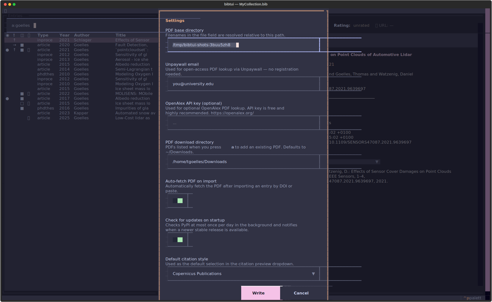
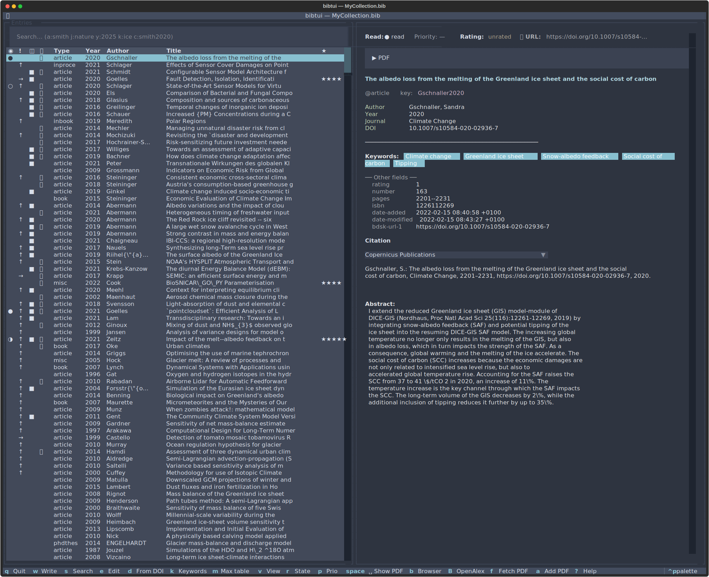
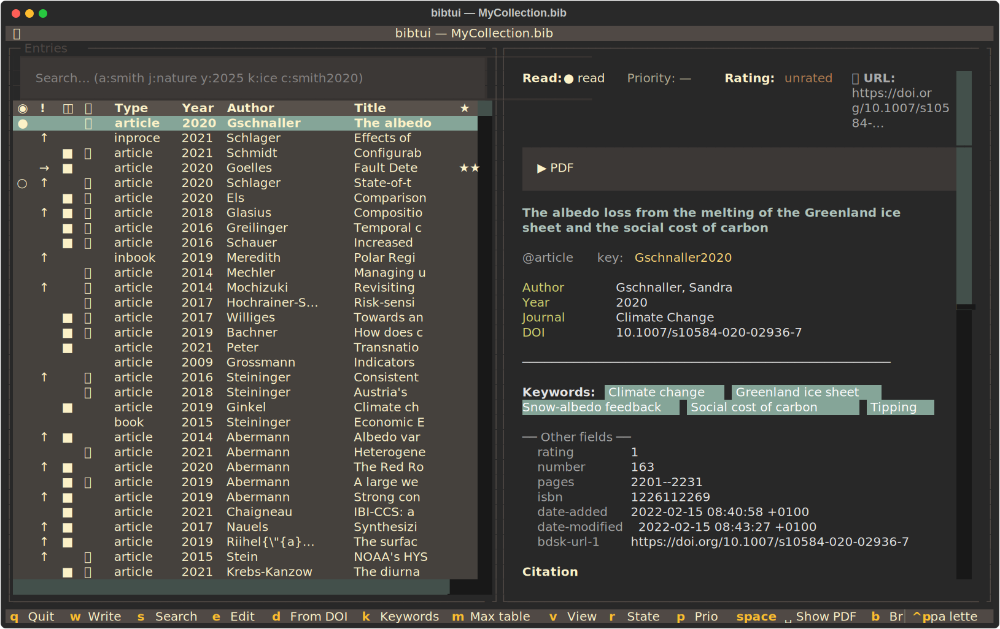
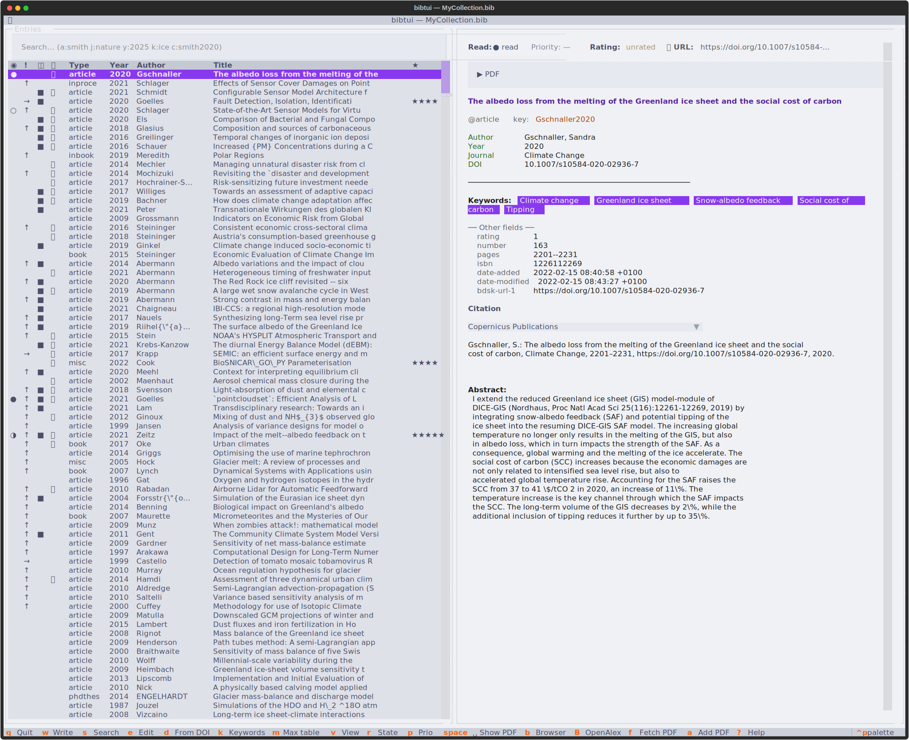

# Configuration

bibtui keeps its settings in a single file at:

```text
~/.config/bibtui/config.toml
```

You normally never edit it by hand — change everything from the **Settings**
screen inside the app.

## The settings screen

Open the command palette with <kbd>Ctrl</kbd>+<kbd>P</kbd> and choose
**Settings**.

{ loading=lazy }

| Setting                       | What it does                                                            |
| ----------------------------- | ---------------------------------------------------------------------- |
| **PDF base directory**        | Where fetched and attached PDFs are stored, and where links resolve.   |
| **Unpaywall email**           | Used only for rate-limiting Unpaywall requests — no account needed.    |
| **OpenAlex API key**          | Optional. OpenAlex is always free; a free API key raises your daily request limit. |
| **PDF download directory**    | The folder bibtui browses when you attach an existing PDF (<kbd>a</kbd>). |
| **Auto-fetch PDF on import**  | When on, bibtui automatically fetches the PDF after you import an entry by DOI or paste (if it has a DOI/URL and a PDF directory is set). |
| **Check for updates on startup** | When on, bibtui checks PyPI once a day for a newer release.         |
| **Default citation style**    | The default CSL style for the citation preview and <kbd>Shift</kbd>+<kbd>C</kbd>. |

Save with <kbd>Ctrl</kbd>+<kbd>S</kbd>.

## Themes

bibtui supports the full range of [Textual](https://textual.textualize.io/)
themes — Catppuccin, Nord, Dracula, Gruvbox, Tokyo Night and more — selectable
from the command palette.

=== "Nord"

    { loading=lazy }

=== "Gruvbox"

    { loading=lazy }

=== "Light"

    { loading=lazy }

### Automatic desktop theming

If you run [Omarchy](https://omarchy.org), bibtui detects your active desktop
theme and matches it automatically, updating live when you switch. Pick a theme
manually at any time and bibtui remembers your choice; reset it from the command
palette to follow the OS again.

## Citation styles (CSL)

bibtui loads citation styles from:

```text
~/.config/bibtui/csl/
```

On first run it seeds this folder with common defaults:

- `copernicus-publications` — Copernicus / EGU journals
- `apa` — psychology, social sciences, education
- `ieee` — engineering, computer science
- `vancouver` — medicine / biomedical
- `chicago-author-date` — humanities
- `harvard-cite-them-right` — common across Europe and Australia

To add more, download `.csl` files from the
[Citation Style Language repository](https://github.com/citation-style-language/styles)
and drop them into that folder. They'll appear in the style picker.
