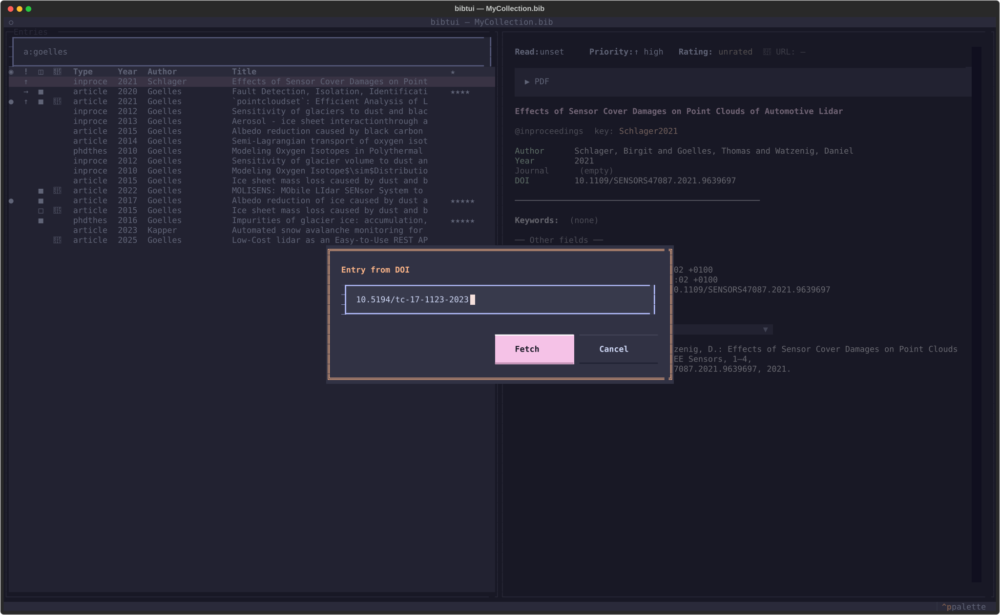

# Importing references

You rarely type BibTeX by hand in bibtui. There are five ways to add an
entry — manually, by DOI, from a PDF, from a `.bib` file, or by pasting raw
BibTeX — and all of them refuse to create duplicate cite keys.

Press <kbd>n</kbd> to open the "New Entry" chooser, then pick one with its
mnemonic key: <kbd>m</kbd> fill out manually, <kbd>d</kbd> import by DOI,
<kbd>p</kbd> import from PDF, <kbd>b</kbd> import a `.bib` file, or
<kbd>v</kbd> paste BibTeX. The number keys <kbd>1</kbd>–<kbd>5</kbd> work too.

## Create a new entry

Press <kbd>n</kbd> then <kbd>m</kbd> to open the new-entry form. Pick the entry
type (article, book, inproceedings, …) and the form shows that type's fields
under their real BibTeX names: **required fields are marked with `*`** and
listed in the hint under the type selector, then `doi`, `url` and `note`, then
the remaining optional fields.

The cursor starts in the first field (usually the author) rather than the cite
key, because the key is filled in for you: it's suggested automatically from the
author and year (in `AuthorYear` form) and shown dimmed and italic while
auto-generated, so you can see at a glance that it will follow the author/year.
Type your own key any time to take over; the styling switches to a normal key
and stops auto-updating.

Every new entry is stamped with a `date-added` timestamp automatically, so the
**Added** column and date sorting work straight away — you never enter it by
hand. When you save, the entry is validated with the BibTeX parser first, so a
malformed cite key or field can't be written to your `.bib` file.

Switching the entry type re-shapes the form to match the new type while keeping
any values you already typed.

!!! note "Keywords are managed separately"

    The form doesn't include a keywords field — keywords are curated in the
    [keywords picker](keywords.md) (<kbd>k</kbd>), which lets you reuse the ones
    already in your library. Add the entry first, then press <kbd>k</kbd>.

### Custom fields

Need a field the form doesn't show — `isbn`, `urldate`, `eprint`, or anything
else? At the bottom of the form, pick one from the **Common field** dropdown or
type any field name and press <kbd>Enter</kbd> (or **Add**). It appears as a new
input you can fill in, and the <kbd>✕</kbd> button removes it again. Any field
name is accepted, so you're never limited to the built-in list.

### What gets checked when you write

When you press <kbd>Ctrl</kbd>+<kbd>S</kbd> (or **Write**), bibtui validates the
entry before it touches your `.bib` file. There are three levels:

- **Auto-fixed** — small corrections are applied for you and shown in the form
  (the fixed inputs are highlighted, and you press Write once more to confirm):
  a `12-23` page range becomes `12--23`, a `https://doi.org/…` DOI is reduced to
  the bare identifier, and bare `&`, `%`, `#` in text fields are escaped to
  `\&`, `\%`, `\#`. Intentional LaTeX and maths (`$…$`, `_`, `\&` that's already
  escaped) and accented Unicode are left exactly as you typed them.
- **Flagged** — surfaced as a warning but never blocks the write, e.g. an
  implausible `year` (outside ~1450–next year).
- **Blocked** — the entry is not written and the offending fields are outlined
  in red: a missing required field for the entry type (e.g. `journal` on an
  `@article`), a missing or non-numeric `year` where the type requires one, or
  a cite key that is empty, contains spaces, or wouldn't parse as valid BibTeX.

The same checks run when you **edit** an existing entry (<kbd>e</kbd>), so
editing feels identical to adding — with one deliberate difference: a required
field that was *already* empty (or a `year` that was already non-numeric) when
you opened the entry is only flagged, never blocked, so you're never trapped
fixing an unrelated field in a messy entry. This validation only ever runs in
the form; opening a `.bib` file never validates or rejects anything.

## Import by DOI

Press <kbd>n</kbd> then <kbd>d</kbd>, paste a DOI, and bibtui fetches the full
metadata online and builds the entry for you.

{ loading=lazy }

This is the quickest way to add a paper you found in a browser or a reference
list — copy the DOI, press <kbd>n</kbd> then <kbd>d</kbd>, paste, done.

!!! tip "PDFs are fetched automatically"

    With **Auto-fetch PDF on import** enabled (the default), bibtui downloads the
    open-access PDF right after import — so a DOI often becomes a fully-linked
    entry, PDF and all, in one step. It needs a DOI or URL on the entry and a PDF
    directory set. Turn it off in [settings](../configuration.md) if you'd rather
    fetch manually with <kbd>f</kbd>.

## Import from PDF

Press <kbd>n</kbd> then <kbd>p</kbd> to build entries straight from PDF files
already on disk — handy for clearing out an old downloads folder or a migrated
Papers/Zotero library. The picker reuses "Add PDF"'s browse-and-filter list
(it defaults to the configured download directory; paste a different folder
path in to browse elsewhere) but as a checklist, so you can pick several files
at once instead of one per entry.

Each selected PDF is scanned for a DOI or arXiv id — first in the embedded
document metadata, then in the text of its first two pages — and the
identifier is validated and its metadata fetched through the same CrossRef
pipeline as "Import by DOI". Nothing is written until you confirm: a report
screen lists every file with a ✓/✗ mark and the reason a file failed (an
ambiguous file's candidate DOIs are shown too, so you can copy one out and use
"Import by DOI" yourself). Press <kbd>Space</kbd> on any row, success or
failure, to preview its PDF. One "Import N Entries" click then commits every
✓ row at once.

- If the DOI already matches an entry in your library, no duplicate entry is
  created; if that entry has no PDF linked yet, this PDF is linked to it (✓)
  instead of being silently skipped — including duplicate PDFs within the
  same selection.
- If the exact same PDF (by content, not filename) is already sitting in your
  configured PDF folder under any name, it's reused instead of being copied in
  again; otherwise matched PDFs are moved into the PDF folder and linked, the
  same as "Add PDF".
- Files with no extractable text, or where CrossRef can't be reached, are
  reported per-file and never block the rest of the batch.

## Import a `.bib` file

Press <kbd>n</kbd> then <kbd>b</kbd> to import a downloaded `.bib` file — for
example the "Download citation" link on a journal page. The picker is the same
browse-and-filter list as "Import from PDF"/"Add PDF" (it defaults to
`~/Downloads`; paste a folder path in to browse elsewhere; <kbd>Space</kbd>
previews the highlighted file, <kbd>Enter</kbd>/<kbd>x</kbd> choose it), just
for a single `.bib` file instead of a PDF checklist.

A file with one entry is added directly — no review screen, same as "Import by
DOI". A file with several entries shows a report first: ✓ for a new entry, ✗
for one already in your library (matched by DOI, including a duplicate DOI
within the same file) — entries without a DOI are always treated as new. One
"Import N Entries" click commits every ✓ row. It reuses the same parser that
loads your main library, so there's no size limit beyond what a `.bib` file
can hold.

## Paste raw BibTeX

If you already have a BibTeX snippet (for example from a publisher's "cite this"
button or Google Scholar), press <kbd>Ctrl</kbd>+<kbd>V</kbd> to paste it
directly as a new entry — or press <kbd>n</kbd> then <kbd>v</kbd> and paste
into the prompt. Like entries created with the form, pasted entries are
stamped with a `date-added` timestamp automatically if they don't carry one.

## Cite-key conflicts

Every method checks your library for an existing entry with the same cite key:

- If a different paper already uses the key, bibtui assigns the next free
  lowercase suffix — `Goelles2025`, then `Goelles2025a`, `Goelles2025b`, and so
  on.
- If the key **and title** match an existing entry, the import is rejected as a
  duplicate, so you don't end up with the same paper twice.

## Unify cite keys

Imported references can arrive with inconsistent keys. From the command palette
(<kbd>Ctrl</kbd>+<kbd>P</kbd>) choose **Library: Unify citekeys (AuthorYear)** to
normalise every key to the `AuthorYear` convention. Entries that already match
are left untouched.

!!! warning

    Changing cite keys can break `\cite{...}` references in existing LaTeX
    documents. Run this on a fresh library, or be ready to update your
    manuscripts — and since your `.bib` is under
    [version control](../collaboration.md), you can always review the diff first.
