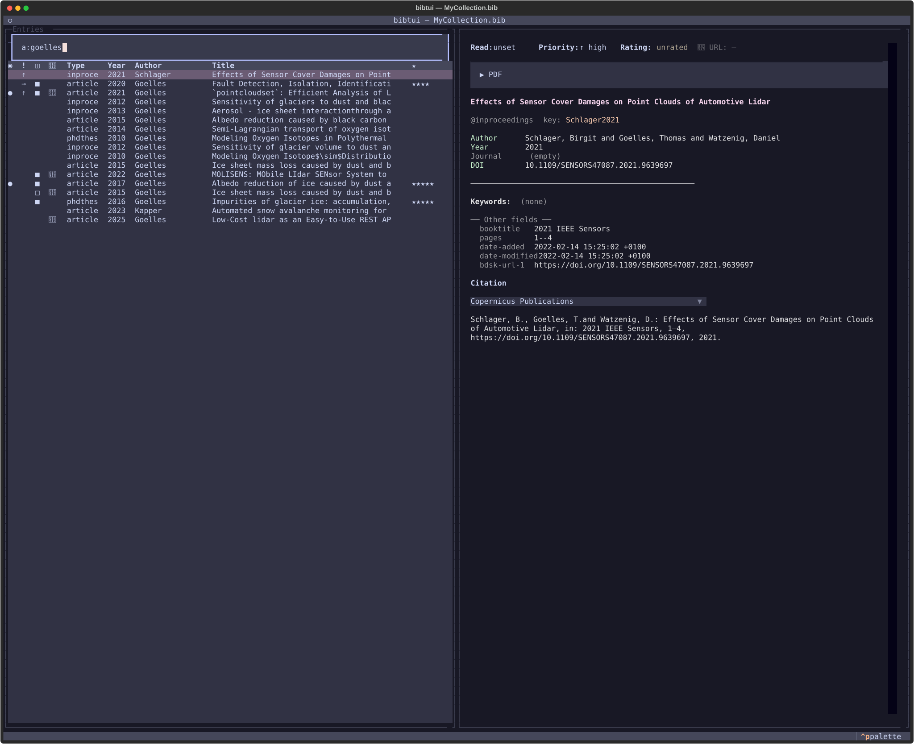

# Searching your library

A reference library is only useful if you can find things in it. bibtui filters
as you type, across a library of thousands, with no indexing step.

Press <kbd>s</kbd> to jump to the search box, type your query, and the table
narrows live. Press <kbd>Enter</kbd> to move into the results, or
<kbd>Esc</kbd> to clear the search.

{ loading=lazy }

## Plain text

Type any words to search across **title, author, keywords and cite key** at
once. Multiple words are combined with AND — every word must match somewhere:

```text
glacier melt
```

## Field prefixes

To search a specific field, prefix a term. Both a short and a long form work.
Quote a value that contains a space, e.g. `k:"sea ice"`:

| Prefix                 | Searches           | Example            |
| ---------------------- | ------------------ | ------------------ |
| `a:` / `author:`       | author             | `a:smith`          |
| `t:` / `title:`        | title              | `t:glacier`        |
| `j:` / `journal:`      | journal            | `j:nature`         |
| `k:` / `kw:`           | keyword            | `k:"sea ice"`      |
| `y:` / `year:`         | year, range or comparison | `y:2015-2023` |
| `u:` / `url:`          | URL                | `u:arxiv`          |
| `c:` / `citekey:`      | cite key           | `c:smith2020`      |
| `r:` / `state:`        | read state         | `r:to-read`        |
| `pr:` / `urgency:`     | urgency            | `pr:high`          |

## Year ranges

`y:` accepts more than a single year:

```text
y:2015-2023      # closed range: 2015 through 2023
y:2015-          # open range: 2015 or later
y:-2015          # open range: up to 2015
y:>2015          # strictly after 2015
y:>=2015         # 2015 or later (same as y:2015-)
y:<2015          # strictly before 2015
y:<=2015         # 2015 or earlier (same as y:-2015)
```

An entry with no year never matches a range or comparison.

## Combine terms

Prefixes and plain words can be mixed freely. The optional `AND` keyword reads
naturally but changes nothing — terms are always ANDed:

```text
a:smith t:glacier            # Smith, with "glacier" in the title
j:nature AND y:2025          # in Nature, published in 2025
k:ice a:jones                # tagged "ice", authored by Jones
y:2010-                      # published 2010 or later
c:smith2020                  # an exact cite-key lookup
r:to-read pr:high            # still to read, high urgency
```

!!! tip "Find your own papers"

    `a:yourname` is a fast way to pull up everything you've authored — handy
    when assembling a CV or a grant report.

## Saved filters

A search you retype every session is really a saved view waiting to happen —
bibtui calls these **filters**. Keep one `.bib` file for everything, and use a
filter to work inside a slice of it, e.g. "Project X" = keyword `sepp`,
published 2010 or later.

Press <kbd>f</kbd> to open **Filters**:

```text
0 · All entries
1 · ● Project X        — k:sepp y:2010-
2 ·   To read           — r:to-read
```

| Key                       | Action                                                        |
| ------------------------- | -------------------------------------------------------------- |
| <kbd>0</kbd>–<kbd>9</kbd> | Jump straight to that filter (<kbd>0</kbd> is "All entries")   |
| <kbd>Enter</kbd>          | Select the highlighted row                                     |
| <kbd>w</kbd>               | Write the current search as a new (or updated) filter          |
| <kbd>e</kbd>               | Edit the highlighted filter's name/query                       |
| <kbd>d</kbd>               | Delete the highlighted filter (confirmation required)          |
| <kbd>Esc</kbd>             | Close the menu                                                 |

To save a filter: type a search (`k:sepp y:2010-`), press <kbd>f</kbd> then
<kbd>w</kbd>, and give it a name — typing an existing filter's name updates
it instead of creating a new one (confirmed first, in case it was a typo).
The active filter (marked `●`, and already highlighted when you reopen the
menu) is shown in a bar above the search box —
`Filter: Project X  k:sepp y:2010-  42 / 1203` — and in the app's title bar.

The search box then **refines within the active filter**, exactly like
adding another ANDed term. <kbd>Esc</kbd> clears only that refining search —
the filter itself stays on until you pick a different one from the
<kbd>f</kbd> menu, so you can't drop out of your current project by
accident. The last-active filter is remembered across restarts.

Deleting a filter (<kbd>d</kbd>) always drops you back to "All entries" —
even if the one you deleted wasn't the active one — so you never end up
looking at a just-deleted filter's results. "All entries" itself (row 0)
isn't a real filter and can't be deleted; trying to shows a notice instead
of silently doing nothing.

Filters are saved to `~/.config/bibtui/filters.toml` and apply to every `.bib`
file you open — see [Saved filters](../configuration.md#saved-filters) for
the file format.

## Sorting

Click any column header to sort by it; click again to reverse. The active sort
column is marked with `▲` (ascending) or `▼` (descending). Sort by **Added** to
see what's new, by **★** to surface your highest-rated reading, or by **Year**
to scan chronologically.

By default the table is sorted by **Added**, newest first. Your choice is
remembered: the sort you left is restored the next time you start bibtui (saved
under `[ui] sort_column` / `sort_reverse` in `config.toml`).

## Choosing columns

You're not limited to the default columns. From the command palette
(<kbd>Ctrl</kbd>+<kbd>P</kbd> → **Table: Configure columns**) you can pick which
columns the table shows and in what order, including the cite key or any BibTeX
field present in your library. See
[Table columns](../configuration.md#table-columns) for details.
