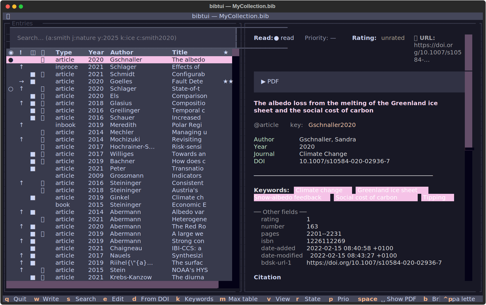
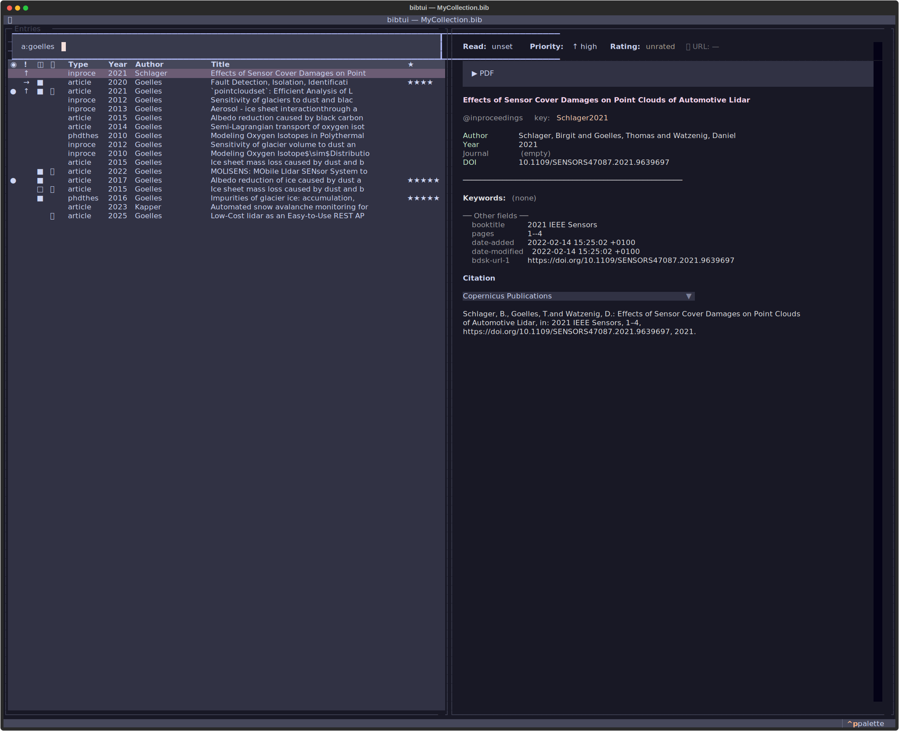
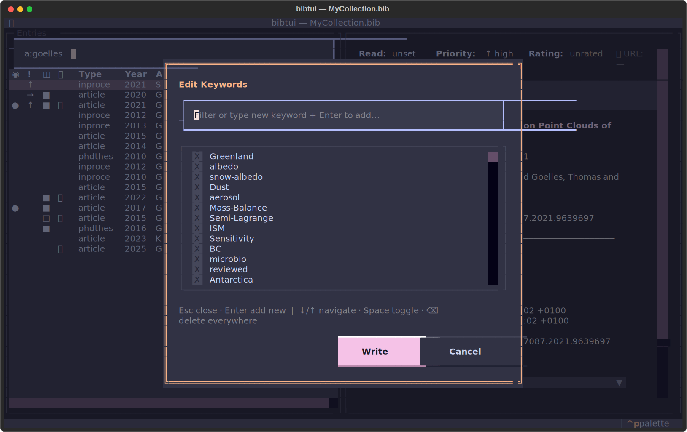
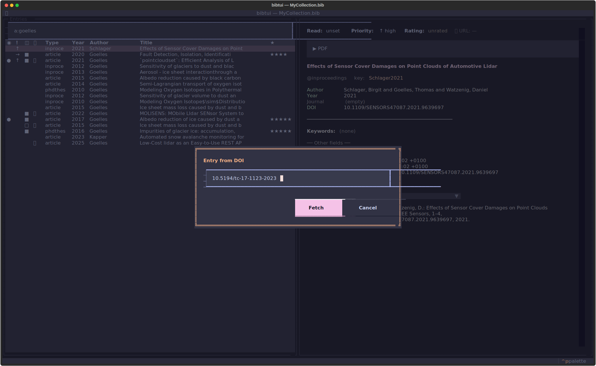

---
hide:
  - navigation
---

# bibtui

<p style="font-size: 1.25rem; color: var(--md-default-fg-color--light);">
A quiet, powerful home for your references.
</p>

**bibtui** is a fast, keyboard-driven terminal app for researchers who work with
BibTeX. Open your `.bib` file, search thousands of references instantly, fetch
open-access PDFs with a single keystroke, and keep track of what you've read —
all without leaving the terminal. No database, no sync daemon, no account.

[Get started](getting-started.md){ .md-button .md-button--primary }
[Install bibtui](installation.md){ .md-button }

{ loading=lazy }

!!! tip "Mouse-friendly, keyboard-fast"

    bibtui works just as well with the **mouse alone** — click rows, scroll,
    select text, and click column headers to sort. Learn a few key bindings to
    move through a large library faster.

---

## What bibtui does

<div class="grid cards" markdown>

-   :material-magnify:{ .lg .middle } __Find anything, instantly__

    ---

    Search across title, author, journal, keywords and cite key as you type.
    Use field prefixes like `a:`, `t:`, `k:` and `y:` to narrow down a library
    of thousands in milliseconds.

    [:octicons-arrow-right-24: Searching your library](guide/search.md)

-   :material-file-download:{ .lg .middle } __Download PDFs automatically__

    ---

    One keystroke fetches the open-access PDF from arXiv, Copernicus, OpenAlex
    or Unpaywall — and links it to the entry. Run it across your whole library
    to fill in everything that's missing, then **copy a PDF to your clipboard**
    to email it or hand it to an LLM.

    [:octicons-arrow-right-24: Fetching PDFs](guide/pdfs.md)

-   :material-tag-multiple:{ .lg .middle } __Organise with keywords__

    ---

    Tag entries, toggle keywords on and off, and filter your library by topic.
    Track read state, priority and star ratings to keep on top of your reading.

    [:octicons-arrow-right-24: Keywords & tags](guide/keywords.md)

-   :material-source-branch:{ .lg .middle } __Built for collaboration__

    ---

    Your library is a plain `.bib` text file — perfect for Git. Share a
    reference collection with your group, review changes, and merge
    contributions the same way you do with code.

    [:octicons-arrow-right-24: Working as a team](collaboration.md)

</div>

---

## Your `.bib` file stays the source of truth

bibtui never hides your data in a proprietary database. It reads and writes the
same plain-text `.bib` file you already use with LaTeX or Typst, and follows
JabRef conventions for file links and metadata — so you can keep using your
existing tools alongside it. Every save writes a backup first.

You don't even have to write LaTeX or Typst. bibtui is just as handy for keeping
your PDFs organised and copying a ready-made citation in any style — straight
onto the clipboard, ready to paste into a manuscript, an email, or a web form.

That means bibtui works anywhere your terminal does: on your laptop, over SSH on
an HPC cluster, or on a colleague's machine. It installs in under a second with
`uv` and needs no setup to get going.

---

## See it in action

=== "Search by author"

    Type `a:goelles` to instantly narrow a large library to one author's work.

    { loading=lazy }

=== "Keywords"

    Tag entries and toggle topics on and off from the keywords editor.

    { loading=lazy }

=== "Import by DOI"

    Paste a DOI and bibtui fetches the full metadata for you.

    { loading=lazy }

=== "Themes"

    Full Textual theming — Catppuccin, Nord, Dracula, Gruvbox and more. bibtui
    also integrates with [Omarchy](https://omarchy.org): it picks up your active
    desktop theme automatically and follows along live when you switch.

    { loading=lazy }

---

## Quick start

```bash
# Run without installing — opens the built-in file browser
uvx --prerelease=allow bibtui

# Or open a specific library directly
uvx --prerelease=allow bibtui myrefs.bib
```

Ready for more? Head to the [installation guide](installation.md) or jump
straight into [getting started](getting-started.md).
