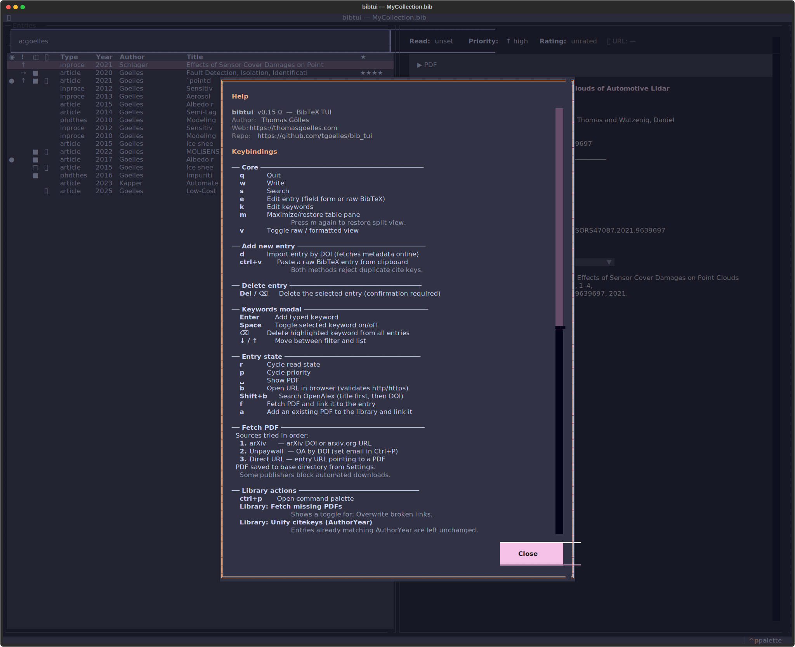

# Keybindings

Press <kbd>?</kbd> inside bibtui at any time for this reference. Modals show
their own keys in the footer.

{ loading=lazy }

## Core

| Key            | Action                                       |
| -------------- | -------------------------------------------- |
| <kbd>q</kbd>   | Quit                                         |
| <kbd>w</kbd>   | Write (save to the `.bib` file)              |
| <kbd>s</kbd>   | Search                                        |
| <kbd>e</kbd>   | Edit entry (field form or raw BibTeX)        |
| <kbd>k</kbd>   | Edit keywords                                 |
| <kbd>v</kbd>   | Toggle field form / raw BibTeX view          |
| <kbd>m</kbd>   | Maximize / restore the table pane            |
| <kbd>?</kbd>   | Show help                                     |

## Adding & removing entries

| Key                              | Action                                |
| -------------------------------- | ------------------------------------- |
| <kbd>d</kbd>                     | Import entry by DOI                    |
| <kbd>Ctrl</kbd>+<kbd>V</kbd>     | Paste a raw BibTeX entry              |
| <kbd>Delete</kbd> / <kbd>⌫</kbd> | Delete the selected entry (confirm)   |

## Entry state

| Key                          | Action                                        |
| ---------------------------- | --------------------------------------------- |
| <kbd>r</kbd>                 | Cycle read state (to-read → skimmed → read)   |
| <kbd>p</kbd>                 | Cycle priority (high → medium → low)          |
| <kbd>1</kbd>–<kbd>5</kbd>    | Set star rating                               |
| <kbd>0</kbd>                 | Clear rating                                  |
| <kbd>Space</kbd>             | Open the linked PDF                            |
| <kbd>b</kbd>                 | Open the entry's URL in a browser             |
| <kbd>Shift</kbd>+<kbd>B</kbd>| Search OpenAlex for the entry                 |

## PDFs

| Key            | Action                                            |
| -------------- | ------------------------------------------------- |
| <kbd>f</kbd>   | Fetch the PDF and link it to the entry            |
| <kbd>a</kbd>   | Attach an existing PDF from your Downloads folder |

## Copying

| Key                                          | Action                                        |
| -------------------------------------------- | --------------------------------------------- |
| <kbd>Ctrl</kbd>+<kbd>C</kbd>                | Copy selected text, or the cite key            |
| <kbd>Shift</kbd>+<kbd>C</kbd>              | Copy the formatted citation (current CSL style)|
| <kbd>Ctrl</kbd>+<kbd>Shift</kbd>+<kbd>C</kbd> | Copy the full BibTeX entry                  |
| <kbd>Ctrl</kbd>+<kbd>Y</kbd>               | Copy the full BibTeX entry (terminal-safe)     |

## Everything else

| Key                          | Action                                        |
| ---------------------------- | --------------------------------------------- |
| <kbd>Ctrl</kbd>+<kbd>P</kbd> | Command palette (settings + library actions)  |
| <kbd>Esc</kbd>               | Clear the search, or close a modal            |

!!! info "In any modal"

    <kbd>Ctrl</kbd>+<kbd>S</kbd> writes/saves and <kbd>Esc</kbd> cancels.
