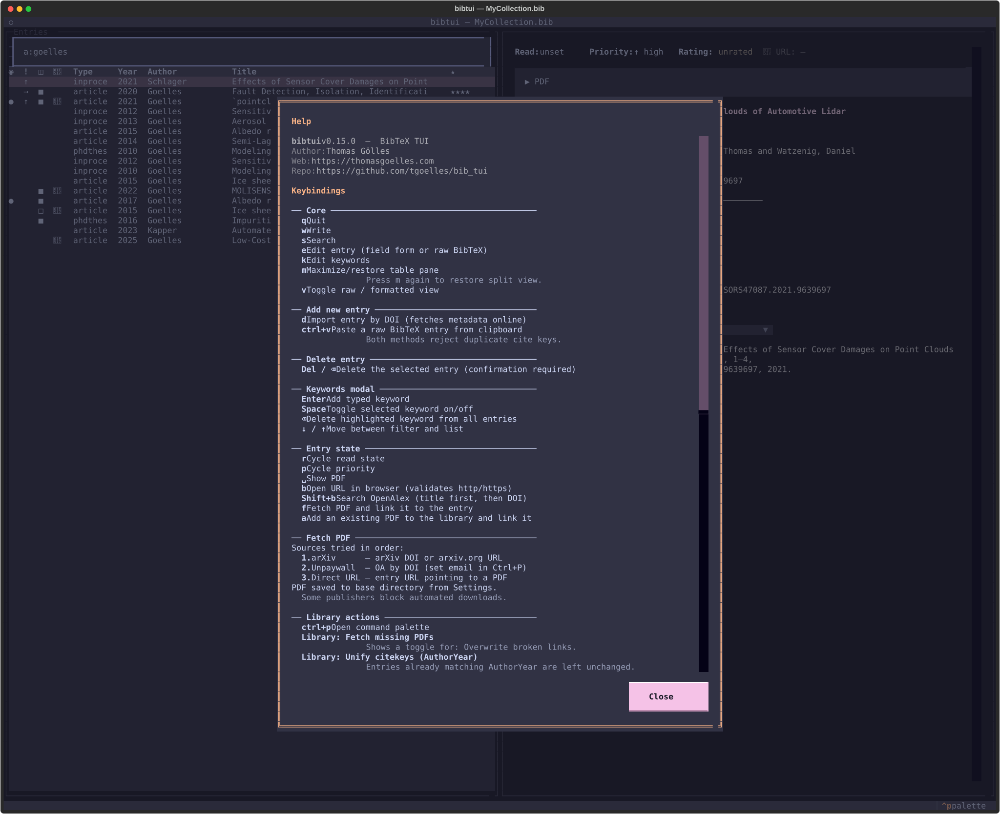

# Keybindings

Press <kbd>?</kbd> inside bibtui at any time for this reference. Modals show
their own keys in the footer.

{ loading=lazy }

## Core

| Key            | Action                                       |
| -------------- | -------------------------------------------- |
| <kbd>q</kbd>   | Quit                                         |
| <kbd>w</kbd>   | Write (save to the `.bib` file)              |
| <kbd>s</kbd>   | Search                                        |
| <kbd>e</kbd>   | Edit entry (field form or raw BibTeX)        |
| <kbd>k</kbd>   | Edit keywords                                 |
| <kbd>v</kbd>   | Toggle field form / raw BibTeX view          |
| <kbd>m</kbd>   | Maximize / restore the table pane            |
| <kbd>&lt;</kbd> / <kbd>&gt;</kbd> | Grow / shrink the detail pane (5% steps, saved to config) |
| <kbd>Ctrl</kbd>+<kbd>d</kbd> | Open the online documentation in your browser |
| <kbd>?</kbd>   | Show help                                     |

## Adding & removing entries

| Key                              | Action                                |
| -------------------------------- | ------------------------------------- |
| <kbd>n</kbd>                     | New entry — then <kbd>d</kbd> import by DOI, <kbd>p</kbd> import from PDF (pick one or more files), <kbd>b</kbd> import a `.bib` file, <kbd>v</kbd> paste BibTeX, or <kbd>m</kbd> fill out manually |
| <kbd>Ctrl</kbd>+<kbd>V</kbd>     | Also auto-detects a pasted BibTeX entry anywhere |
| <kbd>Delete</kbd> / <kbd>⌫</kbd> | Delete the selected entry (confirm)   |

## Entry state

| Key                          | Action                                        |
| ---------------------------- | --------------------------------------------- |
| <kbd>r</kbd>                 | Cycle read state (to-read → skimmed → read)   |
| <kbd>p</kbd>                 | Cycle priority (high → medium → low)          |
| <kbd>1</kbd>–<kbd>5</kbd>    | Set star rating                               |
| <kbd>0</kbd>                 | Clear rating                                  |
| <kbd>Space</kbd>             | Open the linked PDF                            |
| <kbd>b</kbd>                 | Open the entry's URL in a browser             |
| <kbd>Shift</kbd>+<kbd>B</kbd>| Search OpenAlex for the entry                 |

## PDFs

| Key            | Action                                            |
| -------------- | ------------------------------------------------- |
| <kbd>f</kbd>   | Fetch the PDF and link it to the entry            |
| <kbd>a</kbd>   | Attach an existing PDF from your Downloads folder |

## Copying

| Key                                          | Action                                        |
| -------------------------------------------- | --------------------------------------------- |
| <kbd>Ctrl</kbd>+<kbd>C</kbd> / <kbd>⌘</kbd>+<kbd>C</kbd>                | Copy selected text, or the cite key            |
| <kbd>Shift</kbd>+<kbd>C</kbd>              | Copy the formatted citation (current CSL style)|
| <kbd>Ctrl</kbd>+<kbd>Y</kbd> | Copy the full BibTeX entry (also bound to <kbd>Ctrl</kbd>+<kbd>Shift</kbd>+<kbd>C</kbd> / <kbd>⌘</kbd>+<kbd>Shift</kbd>+<kbd>C</kbd>, but most terminals reserve those for their own copy command — see below) |

Copies go to the OS clipboard via the native tool (`pbcopy`, `wl-copy`/`xclip`/`xsel`,
`clip`) and also as an OSC 52 escape for SSH sessions.

## Everything else

| Key                          | Action                                        |
| ---------------------------- | --------------------------------------------- |
| <kbd>Ctrl</kbd>+<kbd>P</kbd> / <kbd>⌘</kbd>+<kbd>P</kbd> | Command palette (settings + library actions)  |
| <kbd>Esc</kbd>               | Clear the search, or close a modal            |

!!! info "In any modal"

    <kbd>Ctrl</kbd>+<kbd>S</kbd> / <kbd>⌘</kbd>+<kbd>S</kbd> writes/saves and <kbd>Esc</kbd> cancels.

!!! note "About the ⌘ and Shift+C-family shortcuts"

    Plain Ctrl shortcuts (<kbd>Ctrl</kbd>+<kbd>C</kbd>, <kbd>Ctrl</kbd>+<kbd>S</kbd>, <kbd>Ctrl</kbd>+<kbd>P</kbd>, <kbd>Ctrl</kbd>+<kbd>Y</kbd>) always work.
    The ⌘ (Cmd) alternative only reaches bibtui in terminals that forward it as
    a distinct key — Kitty, WezTerm, Ghostty, or iTerm2 with the Kitty keyboard
    protocol enabled. In macOS Terminal.app and stock iTerm2, Cmd shortcuts are
    handled by the terminal itself and never reach bibtui, so Ctrl is what
    you'll actually use there.

    <kbd>Ctrl</kbd>+<kbd>Shift</kbd>+<kbd>C</kbd> and <kbd>⌘</kbd>+<kbd>Shift</kbd>+<kbd>C</kbd> are a step less reliable still: most
    terminal emulators claim that exact combination as their own built-in
    "copy selected text" shortcut and never forward it to any app at all —
    for example Kitty's default keymap binds `kitty_mod+c` (`kitty_mod`
    defaults to Ctrl+Shift) to `copy_to_clipboard`, so bibtui never even
    sees the keypress there. This is unrelated to Kitty *keyboard protocol*
    support — it happens at the terminal's own keybinding layer, before any
    protocol negotiation. Where the terminal doesn't claim it outright,
    older/simpler terminals still can't tell Ctrl+Shift+C apart from plain
    Ctrl+C at the byte level, so it falls back to "copy cite key" instead.
    Either way, **use <kbd>Ctrl</kbd>+<kbd>Y</kbd>** for "copy BibTeX entry" — it's the one
    guaranteed to reach bibtui everywhere.
